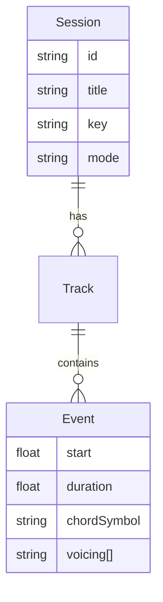

# 要件定義書 — グリッド型コードパッド楽器

## 1. 概要
Web ブラウザ上で動作するグリッド型コードパッド楽器（以下「本システム」）を実装する。ユーザは音楽理論を詳しく理解していなくても、ボタンを適当に押すだけで自然なコード進行を奏でられる。ダイアトニック・コードのみならず、セカンダリードミナントやモーダルインターチェンジ等のノンダイアトニック・コード、sus・add9・maj7 等のテンションを含む拡張和音も扱う。

## 2. 目的
- **直感的創作**: 理論的ハードルを最小化し、創作行為の喜びを提供。
- **多彩な和声**: 初心者が容易に色彩豊かなコードを使用できる。
- **作曲補助**: ループ記録・エクスポートを通じて DAW 連携を促進。

## 3. 主要ユースケース
1. **ジャムセッション**: キーを選択し、複数人でリアルタイム演奏。
2. **アイデアスケッチ**: ループ録音しながらコード進行を試行錯誤。
3. **作曲素材生成**: MIDI/Audio へエクスポートして DAW で編集。
4. **オンライン共有**: 生成したパッド配置や演奏を URL で共有。

## 4. 機能要件
### 4.1 コア演奏機能
- **グリッド UI**: 最小 4×4、推奨 8×8。セル毎にコードを割当。
- **コードエンジン**:
  - ダイアトニック I〜VII。
  - セカンダリードミナント (V/ii 等)。
  - モーダルインターチェンジ (♭VIImaj7 等)。
  - テンション選択 (9,11,13; sus/add 等)。
- **キー & モード切替**: 任意キー、メジャー/マイナー、各モード (Ionian〜Locrian)。
- **ボイシング最適化**: 近接ボイスリーディングでスムーズな接続。
- **演奏モード**: 単発 / ホールド / 持続ストラム / アルペジオ。

### 4.2 ループ・録音
- **ループ長**: 1〜16 小節可変。
- **クォンタイズ**: 1/1〜1/16 ノート。
- **MIDI 録音**: 内部シーケンサ保存。
- **Undo/Redo**: 20 ステップ以上。

### 4.3 保存・共有
- セッション保存 (IndexedDB)。
- MIDI / WAV / stems エクスポート。
- プリセットコードマップの保存 / 共有 URL。

### 4.4 UI/UX
- **リアルタイム配色**: 機能 (Tonic/Pre‑Dom/Dom/ borrowed) で色分け。
- **キーボード/タッチ入力**: PC/Mobile 両対応。
- **フィジカル MIDI**: 外部 MIDI パッド入力マッピング。
- **アクセシビリティ**: スクリーンリーダ対応 ARIA。

### 4.5 拡張機能 (任意)
- AI 推薦進行 (Markov/Transformer)。
- オーディオエフェクトチェーン (Reverb, Delay)。
- コードスケール表示とモチーフ生成。

## 5. 非機能要件
| 項目 | 指標 |
| --- | --- |
| レイテンシ | ≤ 20 ms (ブラウザ処理含) |
| 対応ブラウザ | 最新 Chrome, Safari, Edge, Firefox |
| モバイル対応 | iOS / Android PWA |
| オフライン | 初回ロード後 Service Worker キャッシュ |
| 同時発音数 | ≥ 128 voices |
| セキュリティ | CSP, HTTPS 必須 |

## 6. アーキテクチャ
- **Front‑End**: TypeScript + React + Zustand (state)。
- **Sound Engine**: Web Audio API + Tone.js、AudioWorklet で低レイテンシ。
- **データ**: IndexedDB (Dexie) / localStorage。
- **バックエンド (共有)**: Firebase Functions + Firestore (任意)。

## 7. モジュール構成
1. **UI Layer**
   - GridPad, TransportBar, SettingsPanel, LoopTimeline
2. **Domain Layer**
   - HarmonyEngine, VoicingEngine, LoopRecorder
3. **Infrastructure**
   - AudioEngine, MidiInterface, PersistenceService

## 8. データモデル (抜粋)

## 9. API (例)
`POST /share` → `{ gridLayout, sessionData }` を Base64 URL 化しレスポンス。

## 10. UI プロトタイプ要件
- Figma でワイヤーフレーム (別途)。
- アニメーション: Framer Motion。

## 11. 開発マイルストーン (暫定)
| Phase | 期間 | Deliverables |
| --- | --- | --- |
| 0. 調査 | W1 | HarmonyEngine PoC |
| 1. MVP | W2–W4 | グリッド演奏/キー切替/録音 |
| 2. Loop & Export | W5–W6 | ループ録音・MIDI 出力 |
| 3. Share & PWA | W7–W8 | URL 共有・オフライン |
| 4. Polishing | W9 | UI refine, QA |

## 12. リスクと対策
- **ブラウザ音源遅延**: AudioWorklet, WASM シンセ採用。
- **音楽理論複雑化**: UI はミニマル。高度機能は詳細パネルに隔離。
- **モバイル資源制限**: 動的 voice stealing。

## 13. 将来展望
- コラボレーション同期演奏 (WebRTC)。
- Generative Harmony AI (Style transfer)。
- 3D/VR 空間入力。

---
最終更新: 2025‑04‑24

